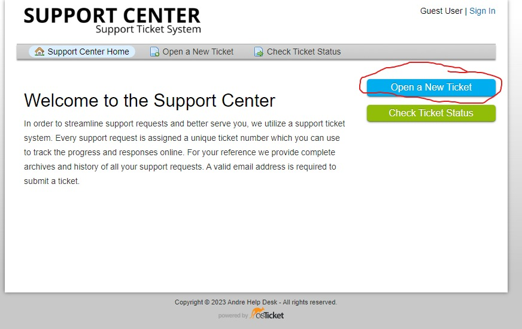
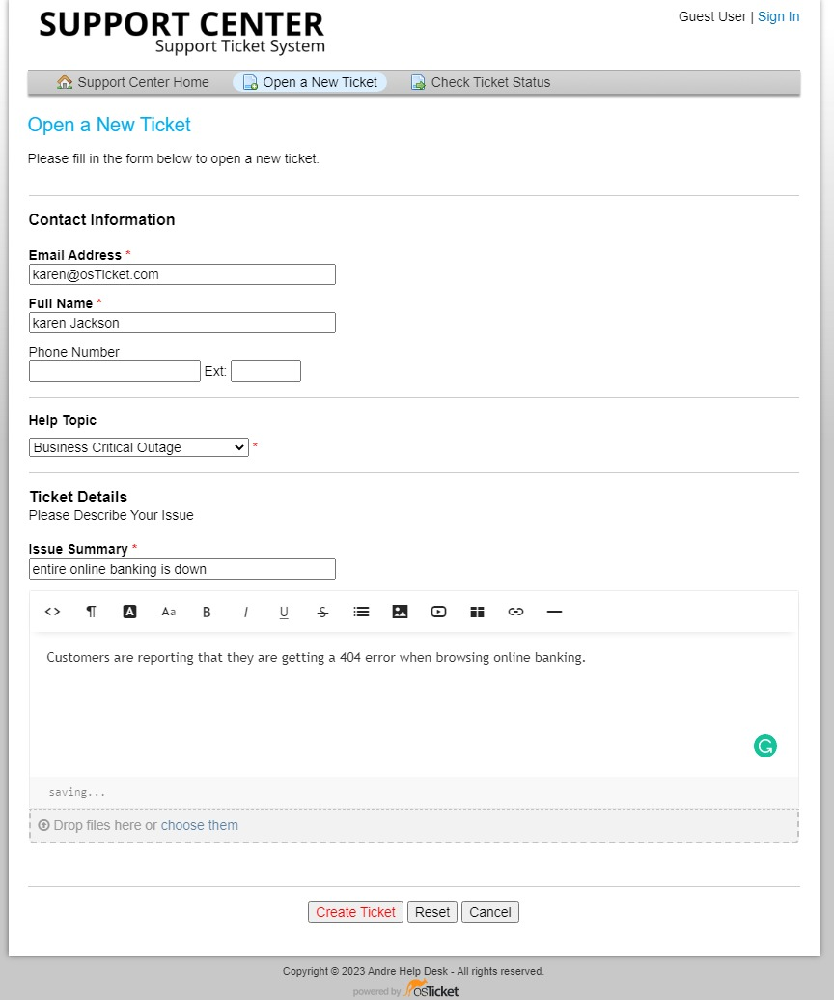

    

# osTicket - Ticket Lifecycle: Intake Through Resolution

This tutorial outlines the lifecycle of a ticket from intake to resolution within the open-source help desk ticketing system osTicket.

---

## Environments and Technologies Used

- Microsoft Azure (Virtual Machines/Compute)
- Remote Desktop
- Internet Information Services (IIS)

---

## Operating Systems Used

- Windows 10 (21H2)

---

## Ticket Lifecycle Stages

- Intake
- Assignment and Communication
- Working the Issue
- Resolution

---

## Lifecycle Stages

- Go to localhost/osTicket
- click open a new ticket
- put in you information 
- select a help topic
- then Ticket details / Issue summary will appear 
- add an issue summary
- add details
- click "Create Ticket" at the bottom
